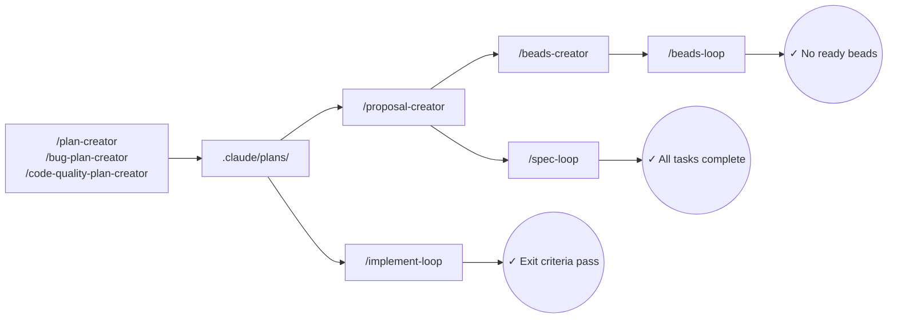

# Essentials for Claude Code

**Plan first. Implement until done.** No more "it's complete" when tests are failing.

## The Problem

Claude Code is powerful, but without structure it can:
- Start coding before understanding the full picture
- Lose track of what's done when context gets long
- Say "done" when tests are still failing
- Hallucinate on large features that exceed context

**The Solution:** Plan first, then implement until exit criteria pass.

```bash
/plan-creator Add user authentication with JWT
/implement-loop .claude/plans/user-auth-3k7f2-plan.md
# Loop continues until ALL exit criteria pass
```

## Install

```bash
/plugin marketplace add GantisStorm/essentials-claude-code
/plugin install essentials@essentials-claude-code
mkdir -p .claude/plans .claude/maps .claude/prompts
# Note: .beads/ directory is created automatically by `bd init` if using Beads workflow
```

## Workflows

| Size | Commands | When to Use |
|------|----------|-------------|
| **Small** | `/plan-creator` → `/implement-loop` | Single session, simple tasks (start here) |
| **Medium** | Plan → `/proposal-creator` → `/spec-loop` | Want human review before coding |
| **Large** | Plan → Proposal → `/beads-creator` → `/beads-loop` | AI hallucinating, multi-session, spans days |



**Small:** `/plan-creator` analyzes codebase → `/implement-loop` executes until exit criteria pass. One session.

**Medium:** `/plan-creator` → `/proposal-creator` creates OpenSpec → **human reviews** → `/spec-loop` implements tasks.

**Large:** `/plan-creator` → `/proposal-creator` (auto-decomposes if large) → `/beads-creator` creates self-contained beads → `/beads-loop` executes with persistent tracking.

## Commands

### Planning

| Command | Purpose | Output |
|---------|---------|--------|
| `/plan-creator <task>` | Create implementation plan | `.claude/plans/{task}-{hash}-plan.md` |
| `/bug-plan-creator <error> <desc>` | Bug investigation plan | `.claude/plans/bug-fix-{desc}-{hash}-plan.md` |
| `/code-quality-plan-creator <files>` | Code quality analysis | `.claude/plans/code-quality-{file}-{hash}-plan.md` |
| `/proposal-creator [plan]` | Convert plan → OpenSpec | `openspec/changes/<id>/` |
| `/beads-creator <spec> [spec2] ...` | Convert spec(s) → Beads | Beads database |

### Loops

All loops: `--step` (default, pause after each task) or `--auto` (continuous). Optional: `--max-iterations N`.

| Command | Completes When | Cancel | Step Options |
|---------|----------------|--------|--------------|
| `/implement-loop <plan>` | Exit criteria pass | `/cancel-implement` | Continue, Stop |
| `/spec-loop <change-id>` | All tasks `[x]` | `/cancel-spec-loop` | Continue, Stop, Pick task |
| `/beads-loop [--label X]` | No ready beads | `/cancel-beads` | Continue, Stop, Pick bead |

### Utilities

| Command | Purpose |
|---------|---------|
| `/codemap-creator [dir]` | Generate JSON code map |
| `/document-creator <dir>` | Generate DEVGUIDE.md |
| `/prompt-creator <desc>` | Create quality prompts |
| `/mr-description-creator` | Create PR/MR description |

### Project Outputs

| Directory | Contents |
|-----------|----------|
| `.claude/plans/` | Architectural plans |
| `.claude/maps/` | Code maps |
| `.claude/prompts/` | Generated prompts |
| `openspec/changes/` | OpenSpec proposals |
| `.beads/` | Beads database (created by `bd init`) |

## Best Practices

1. **Start simple** — Scale up only when you hit problems (hallucinations, lost track).
2. **Exit criteria are non-negotiable** — Not "tests pass" but exact commands: `npm test -- auth`.
3. **Review before looping** — Loops execute autonomously. Editing plans is cheap; debugging bad code is expensive.

| After | Review |
|-------|--------|
| Plan | Architecture, file structure, exit criteria |
| Spec | Requirements, design.md code, task breakdown |
| Beads | Bead descriptions, code snippets, dependencies |

## Auto-Decomposition

Large tasks are **automatically** split—no user prompt needed. Agent assesses complexity after reading input and decomposes immediately if thresholds exceeded.

| Command | Triggers | Decomposition |
|---------|----------|---------------|
| `/implement-loop` | >5 files, >500 lines, >2 subsystems | Grouped sub-todos via `TodoWrite` |
| `/proposal-creator` | >2 subsystems, >2000 lines | Multiple specs with `depends_on` |
| `/beads-creator` | >200 lines per bead | Parent marked `decomposed`, child sub-beads with priorities |

**Output format:**
```
COMPLEXITY ASSESSMENT:
- Files: N (threshold: 5)
- Lines: N (threshold: 500)
- Subsystems: N (threshold: 2)
- Decision: [DIRECT | AUTO_DECOMPOSED]
- Groups created: [list if decomposed]
```

### Decomposition Timeline

```
PLAN                          SPECS (auto-decomposed)           BEADS
────                          ─────────────────────             ─────
.claude/plans/                openspec/changes/                 .beads/
└── billing-plan.md           ├── billing-backend/              ├── epic-001 → task-001, task-002, task-003
    │ 3000 lines              ├── billing-frontend/             ├── epic-002 → task-004, task-005 [blocked by epic-001]
    │ 3 subsystems            └── billing-tests/                └── epic-003 → task-006, task-007 [blocked by epic-002]
    ▼                                   │
/proposal-creator                       ▼
(>2 subsystems → 3 specs)    /beads-creator backend/ frontend/ tests/
                                        │
                             Creates cross-spec dependencies with execution order:

/beads-creator output:
EXECUTION ORDER (by priority):
  P0: task-001, task-002, task-003 (backend - no blockers)
  P1: task-004, task-005 (frontend - after backend)
  P2: task-006, task-007 (tests - after frontend)
```

### Context Chain

Each stage includes a `## Plan Reference` section with `**Source Plan**: <path>` for disaster recovery:

```
.claude/plans/billing-plan.md        ◄── SOURCE OF TRUTH
  │
  ├──► proposal.md
  │    ## Plan Reference
  │    **Source Plan**: `.claude/plans/billing-plan.md`
  │
  ├──► design.md
  │    ## Plan Reference
  │    **Source Plan**: `.claude/plans/billing-plan.md`
  │    + Reference Implementation (FULL code COPIED from plan)
  │
  ├──► tasks.md
  │    ## Plan Reference
  │    **Source Plan**: `.claude/plans/billing-plan.md`
  │    + Exit Criteria (EXACT commands COPIED from plan)
  │
  └──► beads
       ## Context Chain (disaster recovery ONLY)
       **Spec Reference**: openspec/changes/billing/
       **Plan Reference**: .claude/plans/billing-plan.md
```

When context compacts mid-loop, the agent reads the `## Plan Reference` section to find the source plan path. Beads are self-contained (full code in description) but include back-references for recovery.

## How Loops Work

Based on [Ralph Wiggum](https://github.com/anthropics/claude-code/tree/main/plugins/ralph-wiggum) stop-hook pattern (a Claude Code plugin that provides the stop-hook loop pattern for persistent task execution).

**Mechanism:**
1. Setup script creates state file (e.g., `.claude/implement-loop.local.md`)
2. Stop hooks registered in `hooks.json` intercept exit attempts
3. Hook checks transcript for completion signals (`exit criteria passed`, `all todos completed`)
4. Not complete → block with continue prompt. Complete → allow exit, clean up state.

**State file tracks:** `iteration`, `max_iterations`, `plan_path`, `step_mode`, `started_at`

**Step mode:** After each task, outputs execution status then triggers `AskUserQuestion`:
```
===============================================================
TODO COMPLETED: Add validation logic
===============================================================
Progress: 2/5 todos complete

EXECUTION ORDER (remaining):
  Next → Todo 3: Write unit tests
  Then → Todo 4: Run integration tests
  Then → Todo 5: Run exit criteria
===============================================================
```

**Auto mode:** Follows same execution order without pause.

**Recovery:** State file + `plan_reference` in specs enable resume after context compaction or new session.

## Requirements

| Tool | For | Install |
|------|-----|---------|
| OpenSpec | `/proposal-creator`, `/spec-loop` | [Fission-AI/OpenSpec](https://github.com/Fission-AI/OpenSpec) |
| Beads | `/beads-creator`, `/beads-loop` | [steveyegge/beads](https://github.com/steveyegge/beads) |
| Serena MCP | `/code-quality-plan-creator`, `/codemap-creator`, `/document-creator` | `/plugin install serena` |
| Context7 | `/plan-creator`, `/prompt-creator` | `/plugin install context7` |

## Guides

- [WORKFLOW-SIMPLE.md](WORKFLOW-SIMPLE.md) — **Small** tasks: plan → implement
- [WORKFLOW-SPEC.md](WORKFLOW-SPEC.md) — **Medium** tasks: add spec validation
- [WORKFLOW-BEADS.md](WORKFLOW-BEADS.md) — **Large** tasks: persistent tracking

## License

MIT
